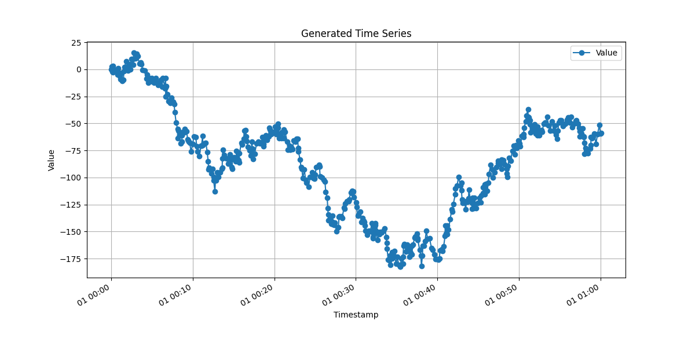
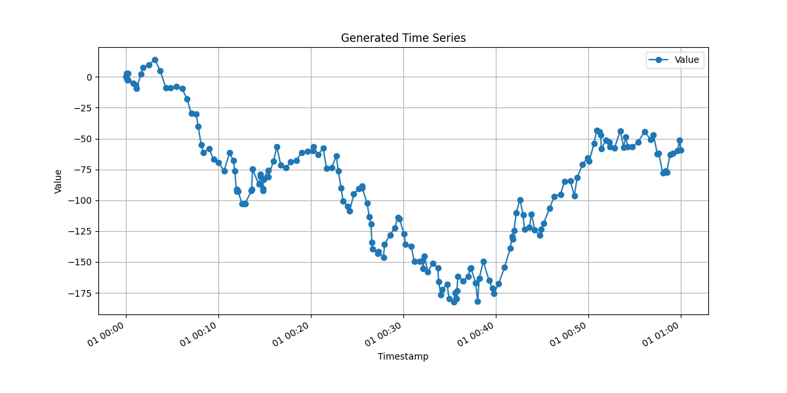

# 📦 dead_band


A Python library leveraging Cython for the implementation of deadband algorithms and related techniques, with the objective of optimizing data throughput and minimizing unnecessary data processing.

## Installation
```bash
pip install dead_band
```

## Examples: Before and After Deadband Processing

### Raw Data (Before Deadband)


### Compressed Data (After Deadband)


## Usage

### Function apply_deadband
```python
apply_deadband (series, deadband_value, max_time_interval, min_time_interval=0, time_unit='s', deadband_type='abs', save_on_quality_change=True, use_cython=True)

Applies a deadband filter to a time series, considering value variation, time intervals (in selectable units), and optional quality changes.

Args:
    series (list): List of tuples (value: float, timestamp: datetime.datetime, quality: Optional[int]). Quality can be omitted (value, timestamp) or included (value, timestamp, quality).
    deadband_value (float): Deadband threshold (absolute value or percentage, depending on deadband_type).
    max_time_interval (float): Maximum time interval (unit defined by time_unit) to force saving a new point.
    min_time_interval (float): Minimum time interval (unit defined by time_unit) to allow saving a new point even with small variation. Default is 0.
    time_unit (str): Unit for time intervals: 's' (seconds), 'ms' (milliseconds), or 'us' (microseconds). Default is 's'.
    deadband_type (str): 'abs' for absolute deadband or 'percent' for percentage-based deadband. Default is 'abs'.
    save_on_quality_change (bool): If True, saves a point whenever the quality changes compared to the last saved point. Only used when quality is provided in the series. Default is True.
    use_cython (bool): If True, uses the Cython implementation for performance. Default is True.

Returns:
    list: New list of tuples with the same structure as input (with or without quality) after applying the deadband filter.

